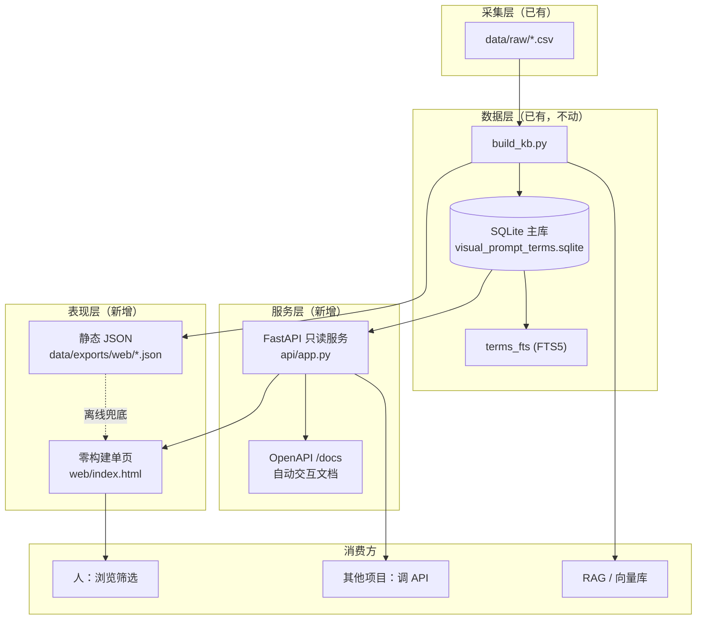

# 升级拓扑方案 V2.0

> 本文档基于对项目当前状态的完整扫描，给出从「可构建的源数据」升级为「可查询、可浏览、可被集成」的知识服务的拓扑方案。
> 核心原则：**SQLite 主库不动，向上叠加薄薄两层——只读 API 服务层 + 零构建前端表现层**，在保持轻量的同时补齐界面与接口能力。

## 1. 项目目的复盘

《AI视觉设计与提示词工程百科》是一套面向 15 卷、约 10,000 条专业术语的结构化知识库。它不是普通词表，而是同时服务两类用途：

- **人类百科**：查得到、看得懂、能学习——每条术语有中英文名、定义、视觉表现、相关与易混淆术语。
- **AI 提示词工程**：用得上——每条术语带 `prompt_usage`、`positive_prompt`、`negative_prompt`，可直接喂给生成模型或 RAG 系统。

因此「升级」的目标不是堆砌功能，而是让这两类用途各有顺手的入口：人有**前端筛选界面**，机器有**可调用的 API**。

## 2. 现状评估

| 层 | 现状 | 评估 |
| --- | --- | --- |
| 数据层 | SQLite 主库，schema 完整（volumes/categories 含层级/terms/aliases/tags/relations/chunks/FTS5/import_runs） | 健壮，无需重构 |
| 采集层 | `data/raw/*.csv` + `build_kb.py` 导入 | 工作良好，已有 90 条数据 |
| 导出层 | Markdown 术语页、RAG JSONL、统计 CSV | 面向「文件」，缺面向「应用」的结构化出口 |
| 检索层 | `search_terms.py`（FTS5 + LIKE 兜底） | 逻辑可复用，但只能命令行 |
| **表现层** | **无** | **缺口：没有界面** |
| **服务层** | **无** | **缺口：没有 API** |

结论：底座扎实，缺的正是「表现层」和「服务层」两块出口。本方案只补这两块，不动主库。

## 3. 目标架构（三层）



设计要点：

1. **数据层是唯一权威**。API 和静态 JSON 都从同一个 SQLite/build 流程派生，不存在第二份真相。
2. **服务层只读**。对外只提供查询，不开放写接口——写入仍走「改 CSV → build」的可追溯流程，避免在线编辑破坏数据契约。
3. **表现层双模式**。前端默认连 API（功能全），探测不到 API 时自动回退读静态 JSON（离线可用、零部署）。
4. **结构同构**。API 返回的术语对象与静态 JSON 里的术语对象**字段完全一致**，前端两套数据源用同一套渲染逻辑。

## 4. API 设计

技术栈：**FastAPI + Uvicorn**。理由：自带 OpenAPI/Swagger 交互文档（其他项目接入时打开 `/docs` 即可试），类型声明即校验，代码量小。依赖仅 `fastapi`、`uvicorn`，列在独立 `api/requirements.txt`，不污染主项目的零依赖采集脚本。

数据库以**只读模式**打开（`file:...?mode=ro`），保证 API 永远不会改坏主库。

### 端点一览

| 方法 | 路径 | 用途 | 关键参数 |
| --- | --- | --- | --- |
| GET | `/api/health` | 健康检查与库状态 | — |
| GET | `/api/meta` | 一次性拉全量元数据（卷、分类、标签、统计），供前端初始化下拉框 | — |
| GET | `/api/volumes` | 卷册列表（含目标量/当前量/完成度） | — |
| GET | `/api/volumes/{code}/categories` | 某卷的分类 | — |
| GET | `/api/tags` | 标签云（含每标签术语数） | — |
| GET | `/api/terms` | **核心**：术语列表，支持筛选/搜索/分页/排序 | `q, volume, category, tag, status, page, page_size, sort` |
| GET | `/api/terms/{term_uid}` | 术语详情（含别名、标签、相关/易混淆术语、chunks） | — |
| GET | `/api/search` | 全文搜索（FTS5 优先，LIKE 兜底），返回带高亮片段 | `q, limit` |
| GET | `/api/stats` | 全局统计（总量、各卷进度、各状态分布） | — |
| GET | `/api/export/prompts` | 按筛选导出纯提示词清单（给提示词工程批量用） | `volume, tag, format=json\|text` |

### 列表响应结构（`/api/terms`）

```json
{
  "page": 1,
  "page_size": 20,
  "total": 90,
  "total_pages": 5,
  "items": [
    {
      "term_uid": "V08_T0001",
      "zh_term": "负向提示词",
      "en_term": "Negative Prompt",
      "volume_code": "V08",
      "volume_title": "Prompt工程学",
      "category": "负向与约束",
      "definition_short": "...",
      "positive_prompt": "...",
      "negative_prompt": "...",
      "tags": ["Prompt", "AI", "质量"],
      "status": "published"
    }
  ]
}
```

### 集成方式（其他项目如何用）

- **REST 直调**：`GET http://localhost:8000/api/terms?volume=V08&q=控制&page=1`，标准 JSON，任何语言可调。
- **看文档**：浏览器打开 `http://localhost:8000/docs`，Swagger UI 可视化试调、自动给出 OpenAPI 规范。
- **CORS 已开**：允许浏览器端跨域调用，前端项目可直接 fetch。
- **离线集成**：不想起服务的项目，可直接读 `data/exports/web/terms.json`（与 API 同构）。

## 5. 前端设计

形态：**单文件 `web/index.html`**，零构建、零依赖、双击即开。原生 JS + 内联 CSS，不引入框架，符合「轻量」。

数据来源探测顺序：启动时先 `fetch('/api/health')`，通则进入 **API 模式**（动态筛选、后端分页、全文搜索）；不通则回退 **离线模式**（读同目录或 `data/exports/web/` 的静态 JSON，前端内存筛选）。界面顶部用一个小徽标显示当前模式。

界面布局：

- **左侧栏**：卷册树（15 卷 + 各卷分类，点击筛选）、状态筛选、标签云。
- **顶部**：搜索框（中英文/别名/定义全文）、排序选择、结果计数、数据模式徽标。
- **主区**：术语卡片网格，每卡显示中英文名、所属卷、分类、一句话定义、标签。
- **详情抽屉**：点卡片右侧滑出，展示完整字段；`positive_prompt`/`negative_prompt` 各带「一键复制」按钮（直接服务提示词工程场景）。
- **分页条**：底部翻页。

## 6. 轻量化取舍

| 选择 | 取舍理由 |
| --- | --- |
| 只读 API，不做在线编辑 | 写入走 CSS→build 可追溯流程，避免在线写破坏数据契约；API 体量减半 |
| FastAPI 而非纯标准库手写 | 用极小依赖换来自动文档、参数校验、可维护性——对"要给别人调用"的 API 是划算的 |
| 前端零构建单文件 | 不引入 Node/打包链路，双击即用，离线可分发 |
| 双模式而非纯 API 驱动 | 保留"没装 Python 也能看"的能力，分发和演示成本最低 |
| 数据库只读模式打开 | 服务层物理上无法改坏主库 |
| 依赖隔离在 api/requirements.txt | 采集脚本仍保持零依赖，两套关注点不互相污染 |

## 7. 实施步骤

1. ✅ 方案文档（本文件）。
2. 扩展 `build_kb.py`：新增导出 `data/exports/web/{terms,volumes,meta}.json`（前端离线源，与 API 同构）。
3. 新增 `api/app.py`（FastAPI 只读服务）+ `api/requirements.txt` + `scripts/run_api.py`（或启动说明）。
4. 新增 `web/index.html`（双模式单页）。
5. 联调：核对 API JSON 与静态 JSON 同构，更新 README 运行说明。

## 8. 运行方式（落地后）

```powershell
# 1. 构建主库与前端静态数据
python scripts/build_kb.py

# 2. 启动 API（需先 pip install -r api/requirements.txt）
python -m uvicorn api.app:app --reload --port 8000
#   - API 文档： http://localhost:8000/docs
#   - 术语接口： http://localhost:8000/api/terms

# 3a. 前端（API 模式）：用 API 自带的静态托管或任意静态服务器打开 web/index.html
# 3b. 前端（离线模式）：直接双击 web/index.html，自动读 data/exports/web/*.json
```

## 9. 未来扩展（预留，不在本期实现）

- **向量检索端点** `/api/semantic`：在 `term_chunks` 上挂 embedding（schema 已预留 `embedding_model`/`embedding_ref` 字段），接入 Chroma/Qdrant 后开放语义搜索。
- **多语言**：`term_aliases.language` 已分语言，可扩出英/日术语界面。
- **关系图谱可视化**：`term_relations` + `volume_relations` 已是图结构，可加一个力导向图页面。
- **导出成书**：复用现有 Markdown 导出，接 Pandoc 出 PDF/EPUB。
