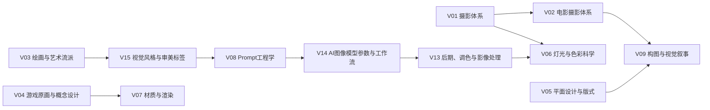

# 卷册拓扑

V1.0 目标总量为 10,000 条术语。原始 8 卷保留，同时补充 7 个外延卷，形成从视觉基础、媒介生产、AI 工作流到审美标签的完整闭环。

| 卷 | 名称 | 目标术语数 | 定位 |
| --- | --- | ---: | --- |
| V01 | 摄影体系 | 500 | 摄影基础、器材、曝光和镜头语言 |
| V02 | 电影摄影体系 | 800 | 镜头景别、运动、影调和电影工作流 |
| V03 | 绘画与艺术流派 | 600 | 艺术史、媒介、笔触和风格来源 |
| V04 | 游戏原画与概念设计 | 1000 | 角色、场景、道具、生物和世界观 |
| V05 | 平面设计与版式 | 500 | 字体、网格、品牌、印刷和信息层级 |
| V06 | 灯光与色彩科学 | 800 | 光度、色彩管理、HDR 和视觉感知 |
| V07 | 材质与渲染 | 500 | PBR、贴图、Shader、渲染和表面质感 |
| V08 | Prompt工程学 | 1000 | 提示词结构、修饰符、参数和评估 |
| V09 | 构图与视觉叙事 | 600 | 视觉语法、观看路径、叙事节奏 |
| V10 | 建筑、室内与空间设计 | 650 | 建筑风格、室内、景观和空间氛围 |
| V11 | 时尚、服装与造型 | 550 | 服装结构、面料、时代风格和人物造型 |
| V12 | 动画、分镜与动态设计 | 650 | 动画原则、分镜、时间控制和动态图形 |
| V13 | 后期、调色与影像处理 | 600 | 修图、调色、合成、滤镜和交付 |
| V14 | AI图像模型参数与工作流 | 650 | 模型、采样、ControlNet、LoRA 和节点流 |
| V15 | 视觉风格、审美标签与时代风格 | 600 | 审美标签、时代、地域、网络美学和混合风格 |

总计：10,000 条。

## 拓扑关系

## 扩展原则

- 基础卷提供稳定概念：摄影、电影、绘画、灯光、色彩、材质。
- 应用卷承载行业场景：游戏、平面、建筑、服装、动画、后期。
- AI 卷负责提示词、模型参数、工作流和检索生成。
- 风格卷作为跨媒介标签层，为提示词和百科导航提供高频入口。

